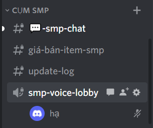

# Hướng dẫn

## Liên kết Discord

Để liên kết Discord với tài khoản Minecraft:

* Sau khi vào cụm Skyblock, gõ lệnh `/discord link`
* Lúc này khung chat sẽ hiện một mã có 4 chữ số, hãy gửi tin nhắn cho con BOT MineVui trong Discord với nội dung là mã này để xác thực!

## Huỷ liên kết Discord

Nếu muốn chuyển liên kết sang tài khoản Discord khác hãy dùng lệnh `/discord unlink` để gỡ liên kết với tài khoản hiện tại và liên kết với tài khoản mới bình thường.

## Sử dụng voice chat

Cụm Skyblock sử dụng voice chat liên kết với Discord, để sử dụng vui lòng đảm bảo tài khoản của bạn **đã liên kết với Discord.**

Trong cụm SMP, click tham gia kênh thoại Skyblock Lobby Voice

Trong bán kính 100 block và chiều cao 64 block trong game, bạn sẽ được kết nối voice tự động với các người chơi khác trong khu vực và có thể giao lưu, nói chuyện với nhau!

.png>)

